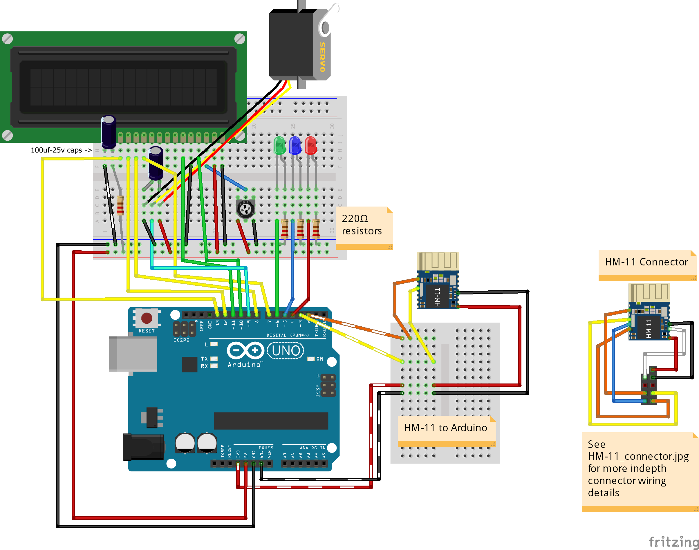
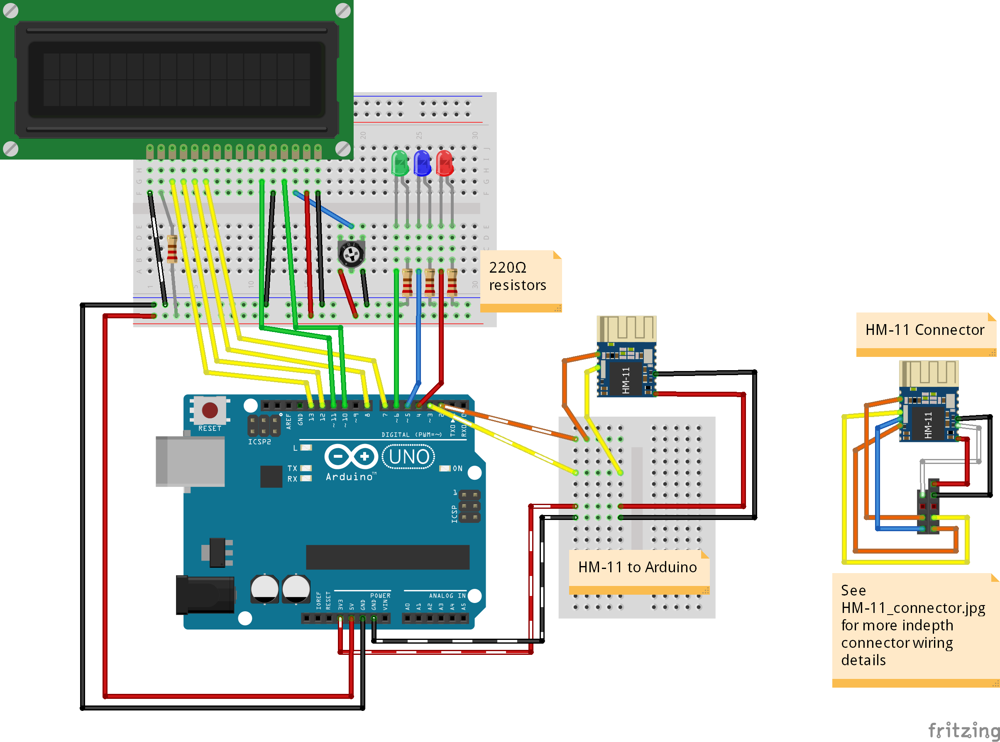
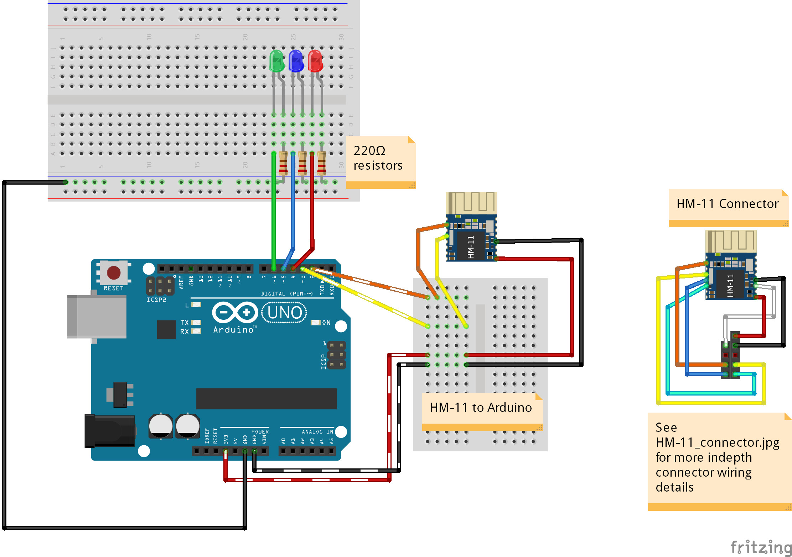

# Myo-Arduino

Arduino code for controlling outputs via use of a Myo Armband. Sketches and libraries can be found in [Arduino/](Arduino/)
#### Myo-Arduino GUI
The GUI purpose is to recieve serial communication sent from the Arduino, the parse the data to find the Myo positioning data (in quaternions). 
The quaternions are then displayed as 3d representations in a window created using OpenGL 3.2 and AntTweakBar.
Located in [MyoArduino_GUI/](MyoArduino_GUI/)

## Requirements
* Arduino (Uno)
* Myo Armband
* MyoBridge Library **(available [here](https://github.com/vroland/MyoBridge))**
* HM-11 BLE Module flashed with the [MyoBridge custom firmware](https://github.com/vroland/MyoBridge/tree/master/myobridge_firmware/Bin)

## Connector

The connector pin setup is shown in this diagram:

## Breadboard setup

Here are the breadboard layouts of the components used for each Arduino sketch.
### Quaternion_angle_servo

### 3LEDs_with_LCD_output

### 3LEDs

Breadboard images and all .fzz files within the Arduino sketch folders were created with [Fritzing](http://fritzing.org).
